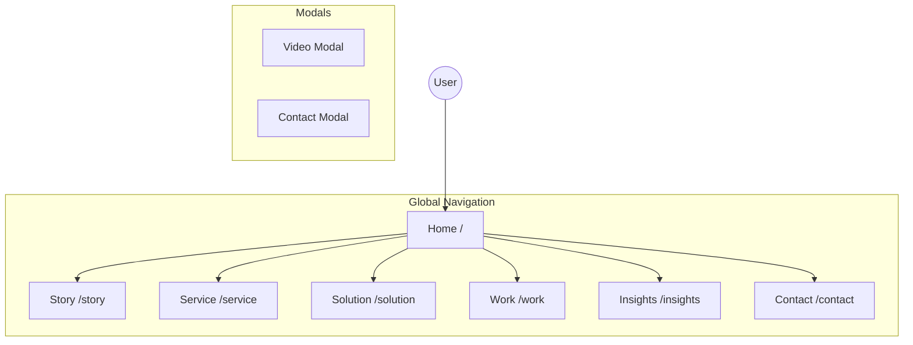

# 프로젝트 페이지 & 컴포넌트 연결 구조 (Flow Architecture)

이 문서는 웹사이트의 각 페이지와 주요 컴포넌트들이 어떻게 상호작용하고 연결되는지를 정의합니다.

## 1. 전체 네비게이션 흐름 (Hub & Spoke)

메인 ‘Home’ 페이지를 중심으로 각 서브 페이지가 방사형으로 연결된 구조입니다.

---

## 2. 페이지별 상세 연결 및 컴포넌트

### 🏠 1. Home (`/`)
모든 진입점의 허브 역할을 하며, 사용자를 '영상 감상(Work)' 또는 '문의(Contact)'로 유도합니다.

*   **Hero Section**
    *   `CTA A (포트폴리오)` ──▶ **Go to `/work`**
    *   `CTA B (프로젝트 문의)` ──▶ **Open `ContactModal`**
*   **Featured Work Section**
    *   `VideoCard` (클릭) ──▶ **Open `VideoModal`** (재생 후 CTA 클릭 시 `ContactModal`로 연결)
    *   `View All` (링크) ──▶ **Go to `/work`**
*   **Business Section**
    *   `Service Card` ──▶ **Go to `/service`**
    *   `Solution Card` ──▶ **Go to `/solution`**

### 🎬 2. Work (`/work`)
포트폴리오 데이터를 필터링하여 보여주는 아카이브 페이지입니다.

*   **Components**
    *   `FilterGroup` (Category/Style/Industry) ──▶ **Refresh Grid** (클라이언트 사이드 필터링)
    *   `VideoCard` Grid ──▶ **Open `VideoModal`**
*   **Data Flow**
    *   `work.ts` 데이터 로드 ──▶ `thumbnailUrl` 렌더링

### 🛠️ 3. Service (`/service`) & Solution (`/solution`)
각 비즈니스 모델에 대한 상세 정보와 전용 포트폴리오를 노출합니다.

*   **Service Page**
    *   `Process Section` (Step 1~4)
    *   `Featured Works` (Service 태그 필터링된 VideoCard) ──▶ **Open `VideoModal`**
*   **Solution Page**
    *   `Browser Window UI` (Hero)
    *   `Use Cases` (Solution 태그 필터링된 VideoCard) ──▶ **Open `VideoModal`**

---

## 3. 공통 컴포넌트 상호작용 (Component IO)

### 📹 VideoCard & VideoModal
영상 썸네일을 보여주고, 클릭 시 모달창을 띄우는 핵심 상호작용입니다.

*   **VideoCard**
    *   **Input:** `title`, `tags`, `duration`, `thumbnailUrl`, `variant`(color)
    *   **Action:** `onClick` 이벤트 발생
*   **VideoModal**
    *   **Input:** `videoUrl`, `ctaType` (service/solution)
    *   **Action:**
        *   영상 재생 (HTML5 Video)
        *   "문의하기" 버튼 클릭 ──▶ `Close VideoModal` & `Open ContactModal`

### 📞 ContactModal & FloatingCTA
어디서든 접근 가능한 리드 수집 경로입니다.

*   **Trigger Points:**
    *   `Header` 메뉴의 Contact
    *   `FloatingCTA` 버튼 (화면 우하단)
    *   `Home` Hero CTA
    *   `VideoModal` 내부 CTA
*   **Status Management:**
    *   `useStore` 또는 `state`를 통해 모달 Open/Close 제어
    *   `Tab` 상태 (Service 문의 vs Solution 문의) 전달
